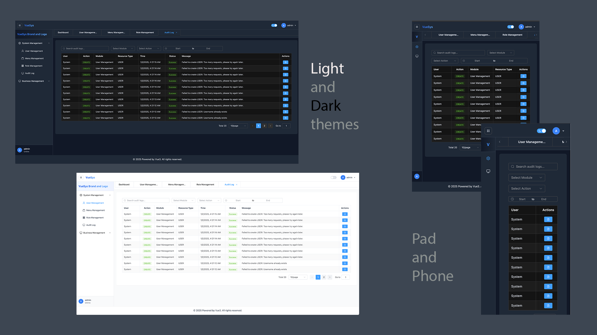

# VueSys - 管理后台后端

[English](./README.md) | 简体中文

## 概述

本项目是 VueSys 管理后台的后端部分，使用 Django 和 Django REST Framework 构建。它提供了用户管理、身份认证、基于角色的访问控制和全面的审计日志等
API。具有安全的令牌处理、HTTPS 支持和活动跟踪功能。

前端项目：[VueSys - 管理后台前端](https://github.com/penn201500/vuesys-vue3-admin-frontend)



## 功能特性

- 🔐 认证系统
    - 基于 HttpOnly cookies 的 JWT 令牌认证
    - 安全的令牌刷新机制
    - 访问令牌和刷新令牌轮换
    - 会话管理
    - CSRF 防护
    - HTTPS/SSL 支持
    - 限流保护
    - 安全头配置
- 👥 用户管理
    - 用户 CRUD 操作
    - 个人资料管理
    - 头像处理
    - 密码管理
- 🔑 基于角色的访问控制
    - 角色管理
    - 权限系统
    - 菜单访问控制
- 📝 全面的审计日志
    - 带时间戳的详细操作追踪
    - 用户活动监控
    - [ ] 系统变更记录
    - IP 地址追踪
    - 请求/响应详情
    - 成功/失败状态
    - 可搜索的审计历史
    - [ ] 可导出的审计报告
- 📊 数据处理
    - 服务端分页
    - 动态排序
    - 过滤搜索
    - 可自定义页面大小
- 🌐 国际化
    - 多语言支持（语言文件尚未完成）
    - 基于 URL 的语言切换
- 🔒 安全特性
    - 限流
    - 令牌黑名单
    - 安全 cookie 处理

## 技术栈

- **Django** - Web 框架
- **Django REST Framework** - API 框架
- **MySQL** - 数据库
- [ ] **Redis** - 缓存（尚未完成）
- **Simple JWT** - JWT 认证
- **PyMySQL** - MySQL 数据库适配器

## 前置要求

- Python 3.12+
- MySQL 8.0+
- Django 5.1
- pip
- anaconda

## 安装

1. 克隆仓库

```bash
git clone https://github.com/penn201500/vuesys-django-admin-backend.git
cd vuesys-django-admin-backend
```

2. 创建并激活虚拟环境

```bash
conda create -n vuesys python=3.12.2
conda activate vuesys
```

3. 安装依赖

```bash
pip install -r requirements.txt
```

4. 配置环境变量
   在根目录创建 `.env` 文件：

```env
DEBUG=True
DJANGO_SECRET_KEY=your-secret-key
DB_NAME=your_db_name
DB_USER=your_db_user
DB_PASSWORD=your_db_password
DB_HOST=localhost
DB_PORT=3306
ALLOWED_HOSTS=localhost,127.0.0.1

CORS_ALLOWED_ORIGINS=http://localhost:5173,http://localhost:3000

RATE_LIMIT_LOGIN=10/m
RATE_LIMIT_REFRESH=3/m
RATE_LIMIT_CSRF=2/m
```

5. 运行数据库迁移

```bash
python manage.py migrate
```

6. 创建超级用户

```bash
python manage.py createsuperuser
```

7. 插入测试记录

```bash
# sys_menu.sql
INSERT INTO vuesys.sys_menu (id, name, icon, parent_id, order_num, path, component, perms, create_time, update_time, remark, deleted_at, status) VALUES (1, 'System Management', 'system', 0, 0, '/settings', '', '', '2024-07-04 00:00:00.000000', '2024-12-30 17:30:55.882450', 'System Management Directory test', null, 1);
# ... (其余 SQL 语句相同，为了简洁这里省略)
```

8. 启动开发服务器

```bash
python manage.py runserver
```

```text
如果你想在开发环境中运行 HTTPS，安装 mkcert 或 certbot，再生成 SSL 文件。然后运行：
```

```bash
python manage.py runserver_plus --cert-file ~/tmp/localhost+2.pem --key-file ~/tmp/localhost+2-key.pem
```

## 开发

### 项目结构

```
djangoProjectAdmin/
├── user/           # 用户管理应用
├── role/           # 角色管理应用
├── menu/           # 菜单管理应用
├── core/           # 审计日志应用和日志处理器
├── settings/       # 项目设置
│   ├── base.py
│   ├── development.py
│   └── production.py
└── urls.py         # 主 URL 配置
```

### 创建新应用

1. 创建新的 Django 应用

```bash
python manage.py startapp new_app
```

2. 在 settings 中的 INSTALLED_APPS 添加应用
3. 创建模型、视图和 URL
4. 在应用的 urls.py 和主 urls.py 中注册 URL

### 数据库迁移

如果模型有更新：

```bash
python manage.py makemigrations
python manage.py migrate
```

### 运行测试

- [ ] 待办：添加测试用例

```bash
python manage.py test
```

## API

主要端点：

- `/api/user/login/` - 用户认证
- `/api/user/users/` - 用户管理
- `/api/role/roles/` - 角色管理
- `/api/menu/menus/` - 菜单管理
- `/api/audit/logs/` - 审计日志

## 贡献

1. Fork 仓库或打开 Pull Request

## 许可证

本项目基于 MIT 许可证 - 详见 [LICENSE](./LICENSE.md) 文件
